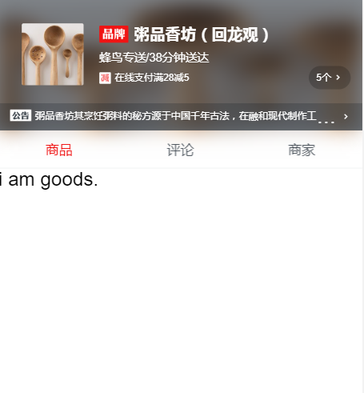

# 项目日志

[TOC]

## 1. 前期准备

### 1.1 需求分析

内容：商品页（包括公告及优惠信息、购物车详情、商品详情）、评价页、商家页

### 1.2 素材准备

下载就行

### 1.3 图标字体制作

上[icomoon.io](icomoon.io)弄就行，傻瓜操作

### 1.4 mock数据

根据设计稿和分析出来的需求去模拟。不过其中遇到了个坑，最新的Vue中的build文件夹里是没有dev-server.js文件的，不知道怎么去mock数据。后来找到了个博客解决了。[<https://blog.csdn.net/qq_34645412/article/details/78833860>](<https://blog.csdn.net/qq_34645412/article/details/78833860>)

  

## 2. 项目骨架开发

### 2.1 编写基本骨架

基本的骨架分成3部分，顶部的header组件，中间的tab组件和下面与tab关联的content内容区块。

### 2.2 安装Vue-router

因为视频里面用的是Vue1.0，但是我机子上的Vue是2.0的，vue-router的挂载和使用都有了较大的差别。而且在Vue2.0中可以在新建模板的时候直接安装vue-router插件。

还有设置默认路由，Vue1.0里面使用的是router.go，但是2.0里面采用的是`{path:'/',redirect:'goods'}`的方式。

## 3. header组件的开发

### 3.1 安装vue-resource

通过vue-source来发送异步请求，获取先前mock的数据

### 3.2 制作header组件的基本布局

下图是用class名来表示的header组件的基本布局图

效果图：

### 3.3 制作header组件的弹出层

#### 3.3.1 制作详情弹出层

CSS Sticky Footer